# windows使用git上传本地代码到github
## 1.安装git，配置ssh
1. git下载地址<https://git-scm.com/downloads> 选择合适的系统，安装下一步
2. 在自己的github创建一个仓库
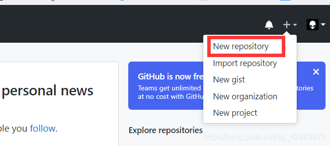
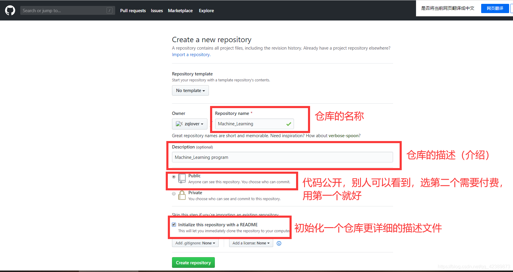
3. 配置ssh密钥这个操作就是让我们的电脑和github进行一个绑定验证
    1. 右键->Git Bash Here 
    2. 需要配置ssh 命令:ssh-keygen -t rsa -C "youremail@qq.com" 
    3. 默认上次回车就好,出现如下界面即生成了ssh密钥
   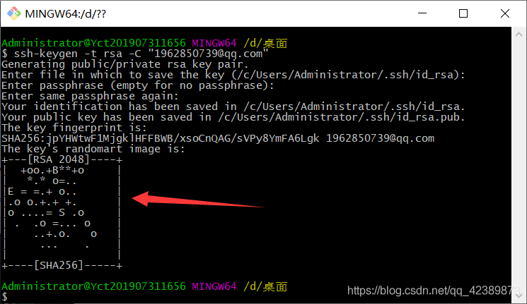
4. 用记事本打开下图中的密钥路径文件,复制里面的密钥 
   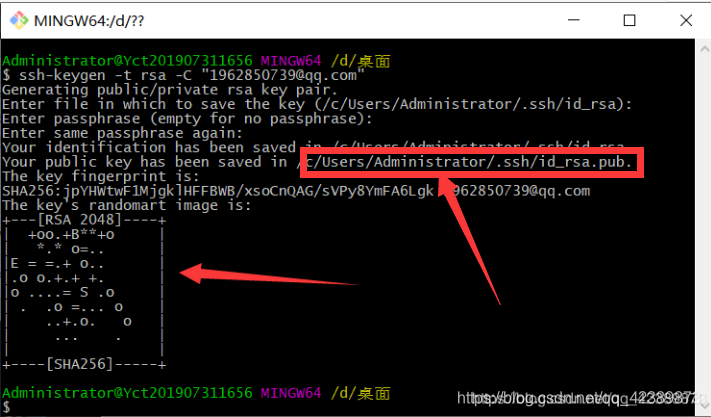
5. 在GitHub中配置密码,如下图操作
   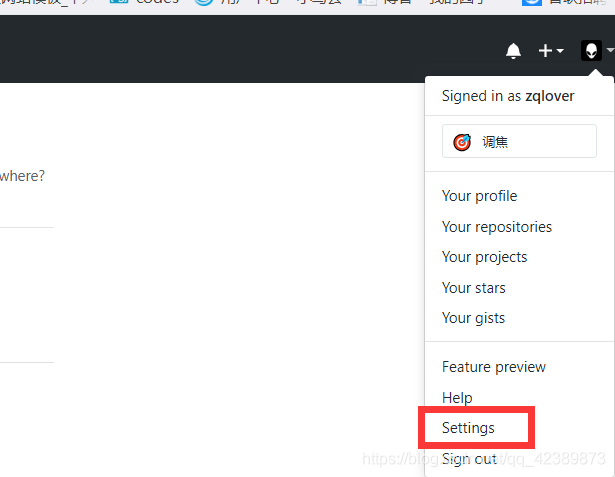
   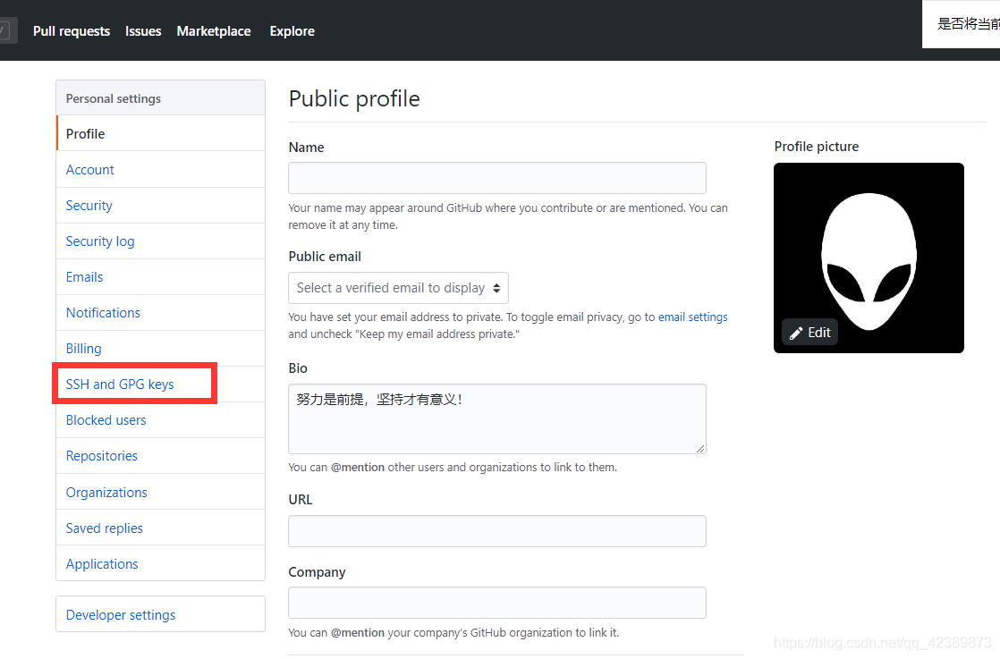
   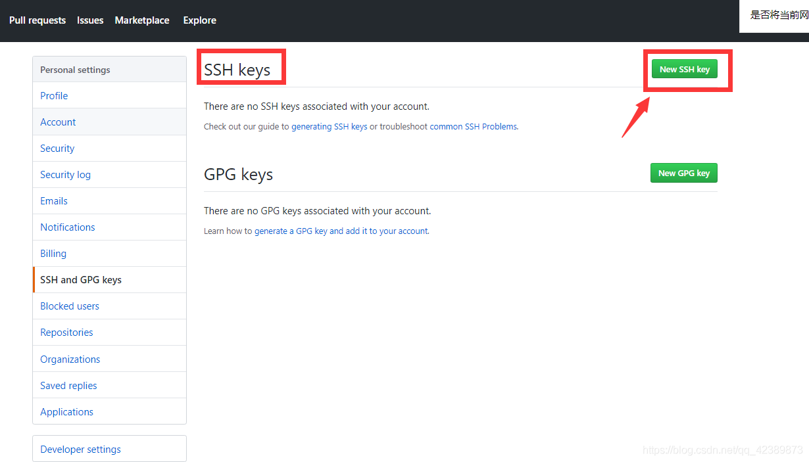
   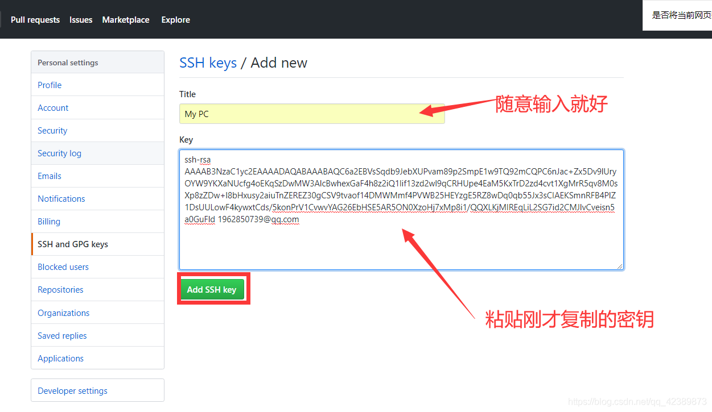
   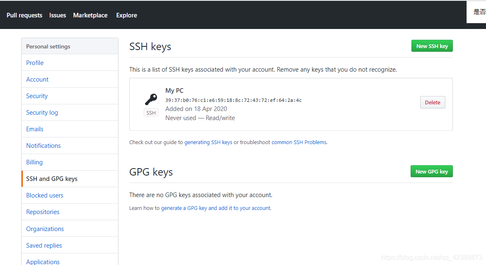
6. 检测配置是否能成功 git输入:ssh -T git@github.com,如果第二次配置我们输入yes就好,看到success就成功了
   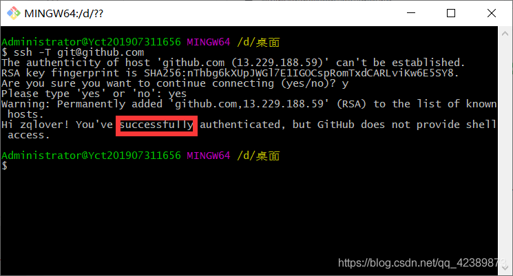
## 2.上传本地代码
1. 设置username和email，因为github每次commit都会记录他们 输入：git config --global user.name "your name" 注册时填写的名字 git config --global user.email "youremail@qq.com" 自己的邮箱、
   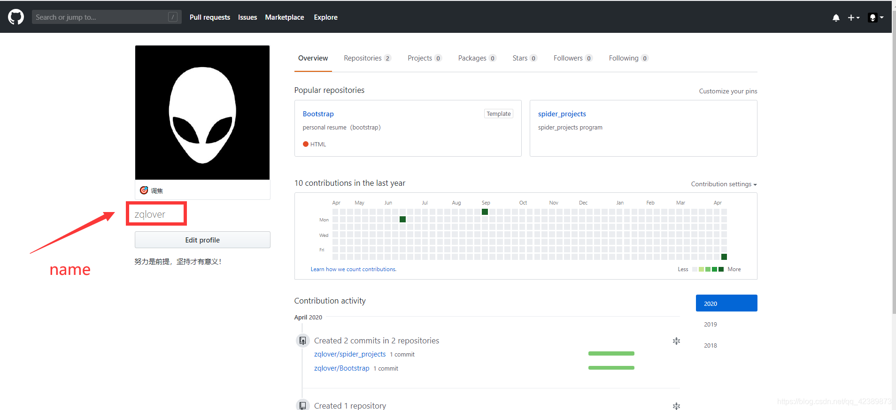
   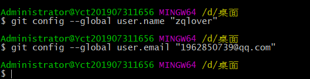
2. 本地操作
   1. 先创建一个文件夹，进入文件，右键进入git bash命令行
   2. 通过命令git init把这个文件夹变成Git可管理的仓库(这个时候会现在文件夹下多了一个.git文件夹。它是Git用来跟踪和管理版本库的。如果你看不到，是因为它默认是隐藏文件，那你就需要设置一下让隐藏文件可见)
   3. 这个时候可以把你的项目复制过来，然后通过*git add* 命令把项目添加到仓库（git add .把该目录下的所有文件添加到仓库，注意点是用空格隔开的）
   4. 用git commit -m "first commit" 把项目提交到仓库(引号是提交的日志)
   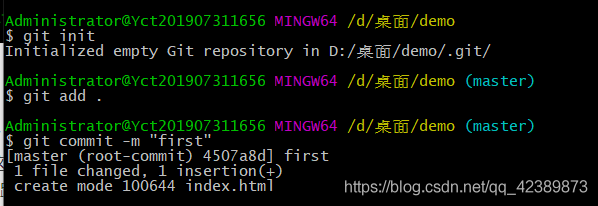
3.  
   1. 与仓库建立连接 复制ssh地址,打开创建的仓库,复制下图ssh地址
   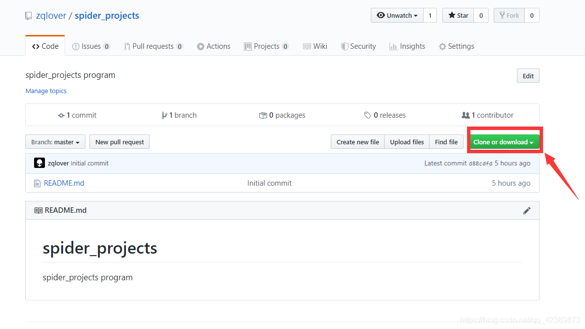
   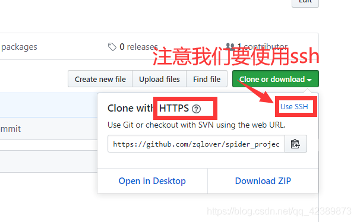
   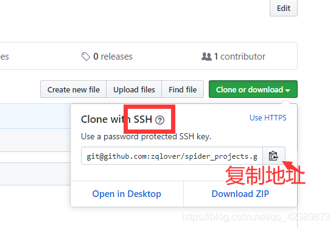
   2.  输入git remote add origin 刚复制的ssh地址
   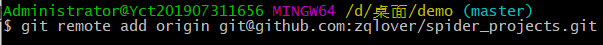
4.  关联好之后我们就可以把本地库的所有内容推送到远程仓库（也就是Github）上了， 通过：git push -u origin master（分支名）
    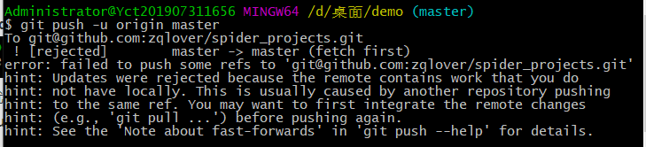
    - 这个时候出现错误了 根据提示,这是由于你新创建的那个仓库里面的README文件不在本地仓库目录中，这时我们可以通过以下命令先将内容合并 git pull --rebase origin master 在使用git push -u origin master提交（这个时候可能有点慢，稍等片刻）
    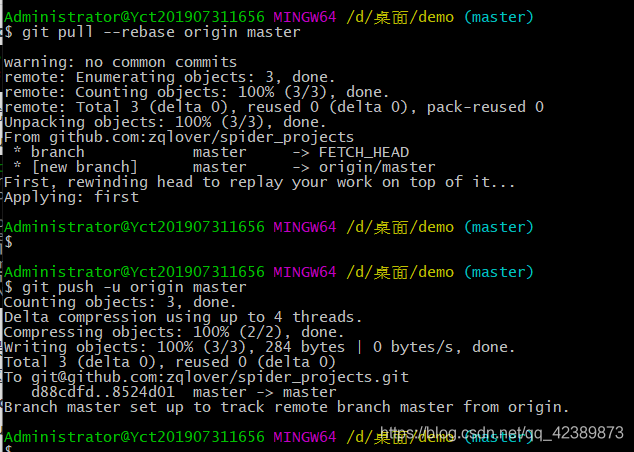
    - 成功之后刷新自己github
 
  切换到min分支
git checkout main

将master分支的代合并到main
git merge master

 查看状态
git status

推送
git push origin main

删除master分支：
git branch -d master

删除远程分支

git push origin --delete master

# 本地代码上传到github

2.1 在本地的项目工程目录下，安装shift，鼠标右键，git bash here，然后依次执行命令：

    1.git init       //工作空间创建.git文件夹（默认隐藏了该文件夹）
    2.git add .      //添加到暂存区
    3.git commit -m "注释"
    4.git remote add origin http://xxxxxxxxx.git   //本地仓库和远程github关联
    5.git pull --rebase origin main    //远程有readme.md，拉一下
    6.git push -u origin main        //代码合并

2.2 在2020年10月1起，github默认主分支从master更名为main，以上提交方式会默认创建一个master分支，为保持一致性，可将本地git init的时候默认分支修改为main，执行：

    git --version    查看版本
    git config --global init.defaultBranch main   git在2.28.0上，重新设置git默认分支为main

2.3 如果=一不小心，创建了mster分支，强迫症，可以执行下面命令删除分支。

    删除本地分支：git branch -d 分支名称
    强制删除本地分支：git branch -D 分支名称
    删除远程分支：git push origin --delete 分支名称

 

----------------------------------------------------------分  隔  线--------------------------------------------------

附：

1.拉代码时候出现：

No tracked branch configured for branch new_protocal or the branch doesn't exist. 
To make your branch track a remote branch call, for example, git branch --set-upstream-to=origin/new_protocal new_protocal
执行：

git branch --set-upstream-to=origin/main main

 

2.电脑使用vpn时，用 git 提交代码至Github，结果报错，报错：

OpenSSL SSL_connect: SSL_ERROR_SYSCALL in connection to github.com:443

可在项目根目录执行：

git config --global --unset http.proxy
